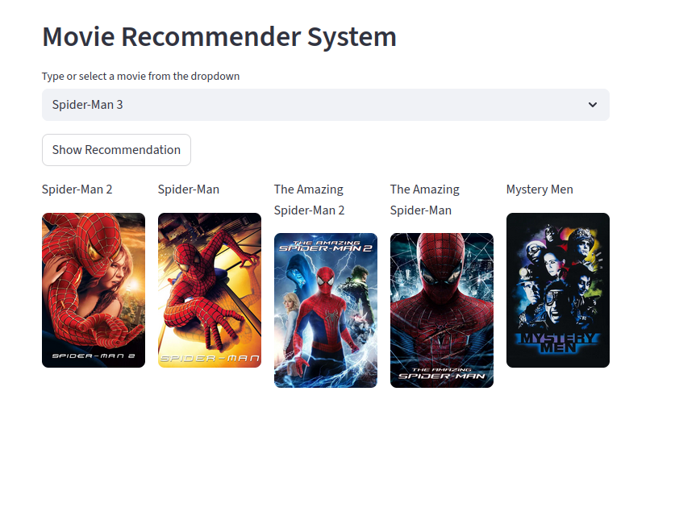

# Movie Recommender System

An interactive Streamlit web app that recommends movies based on your favorite title! Using content-based filtering and The Movie Database (TMDb) API, this app suggests five similar movies along with their posters.

---

## Demo Screenshot

  

---

## Features

- Select any movie from a dropdown
- Get top 5 similar movie recommendations
- View posters fetched in real-time from TMDb
- Simple and elegant Streamlit interface

---

## How It Works

- A **similarity matrix** (cosine similarity on vectorized metadata) is used to compare movies
- Select a movie → top 5 similar movies are recommended
- Posters are fetched using [TMDb API](https://www.themoviedb.org/documentation/api)

---

## Tech Stack

- Python 🐍
- Streamlit 🌐
- scikit-learn
- Pandas
- Requests
- TMDb API

---

## Dataset

This app uses movie metadata from [The Movie Database (TMDb)](https://www.kaggle.com/datasets/tmdb/tmdb-movie-metadata), available on Kaggle:

🔗 [TMDb Movie Metadata Dataset – Kaggle](https://www.kaggle.com/datasets/tmdb/tmdb-movie-metadata)

The dataset contains information like genres, cast, crew, keywords, popularity, and more, which is used to generate content-based movie recommendations.

